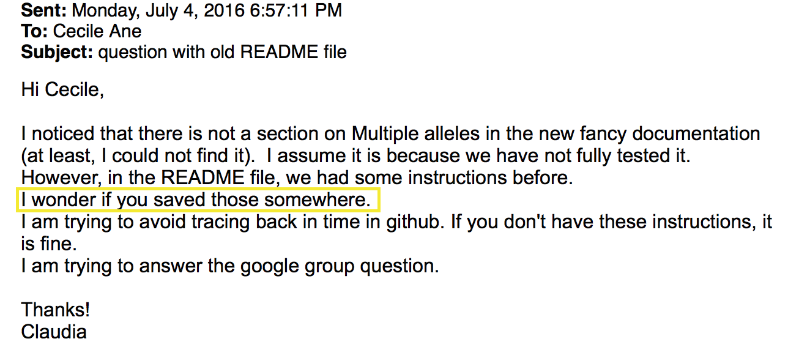
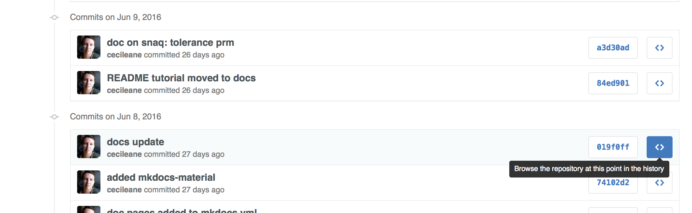

[previous](notes0922.html) & [next](notes0929.html)

---

## homework

You should have finished exercises 1 & 2 in
[homework 1](https://github.com/UWMadison-computingtools/coursedata/tree/master/hw1-snaqTimeTests).
We will be track these files with git next time, so have them ready
by Thursday for sure!


## Git: track and share versions of a project

- you take snapshots of your project once in a while. one "commit" = one snapshot
- git stores the changes between snapshots, not the whole files
- git stores its data (changes) in a special `.git` directory
- you can easily restore the whole project to a previous snapshot, then
  get back to the latest snapshot
- each collaborator has the project on her/his local machine, and
  another remote copy of the project is on GitHub.
  Collaborators can "pull" from GitHub and "push" to GitHub.

jump to:

- [examples](#first-examples)
- [commits, staging area, working directory](#commits-staging-area-working-directory)
- [commit messages](#commit-messages)
- [looking at history](#looking-at-history)
- [moving / deleting tracked files](#use-git-to-move-or-delete-tracked-files)
- [what (not) to track](#what-files-not-to-track--commit)
- [using older commits to fix mistakes](#using-older-commits-to-fix-mistakes)

### first examples

history of repository for the course website:

```shell
git log --abbrev-commit --graph --pretty=oneline --all --decorate
```

example when it was useful to get back to an old version:



we can get the old version of this file in a few clicks:

- go to the project on [github](https://github.com/crsl4/PhyloNetworks.jl)
- click on "863 commits" (or whatever the number is) near top left
- scroll down to a commit that seems to have affected our file of interest



- click on "Browse the repository at this point in the history"
  to see all the files as they were *just before* the change that affected our
  file (June 8th). Tada!
- notice the commit SHA near the top: "Tree: 019f0ff78d".
  Click on it to get back to the current version of the files, typically
  "Branch: master"

---
let's create a repository from our corn SNPs project

```shell
cd ~/Documents/private/st679/zmays-snps
ls -lR
git init # initialize repo: creates .git/
git status
git add readme.md data/readme # git now tracks these files
git status
echo "Zea Mays SNP Calling Project" >> readme.md
cat readme.md
git status # readme.md is tracked, previous version in staging area, new version not
```

### commits, staging area, working directory

commit -- ... -- commit -- staging area -- working directory: tracked files, untracked files

```shell
git diff # differences between new version and staged area (if present) or last commit
git add readme.md # adding new edits to staging area
git status        # readme.md only in staging area
git diff          # no differences btw working dir and staging area
git diff --staged # diff between staging area and last commit
```

now take the snapshot

```shell
git commit -m "initial commit, main readme only"
```
With `git commit` only, an editor will show up to let you edit your
commit message. If you get a weird-behaving editing window (vim),
type `:q!` (to quit without saving) then change your git configuration to use
nano instead of vim:

```shell
git config --global core.editor nano
```

### commit messages

- first line: title
  * informative. forbidden: "update", "continued", "new code", "misc", "edits"
  * 50 of fewer characters is strongly recommended
- if more explanations are needed: add one blank line
- then your explanation paragraph

informativeness: helps to recover old versions (example above)  
separation of title vs paragraph: good example
[here](https://github.com/crsl4/PhyloNetworks.jl/commit/310a81a90db2661bbba3efae1db2378d3f15f88b), suboptimal example
[here](https://github.com/khabbazian/l1ou/commit/bc8df7a9caffbb06d7bef298bdf6c5f7c1df92f9)

### looking at history

let's check:

```shell
git show   # shows last commit: title, paragraph, diffs: change "hunks"
git status # nothing in staging area, but some files not tracked
git log
```

add more edits:

```shell
echo "Project started 2016-09-14" >> readme.md
git diff
git commit -a -m "added project info to main readme"
git log
```

option `-a` in git commit: to add all changes in tracked file to the commit.

### use git to move or delete tracked files

```shell
git mv data/readme data/readme.md
git status
git commit -m "added markdown extension to data readme"
git log
```

### what files (not) to track / commit

track:

- scripts
- text documentation with metadata: explain where the data are archived,
  how to reproduce result files
- notebooks (code + explanations + interpretations) in text format
  (md or html): but preferably only final version of 'compiled'/knitted version.

do **not** track:

- large files that can be reproduced by the pipeline
- large data files: if can be obtained from outside archive
- binary files: document where they were obtained or how to recompile
- pdf and figures: document how they can be reproduced

We can tell git to ignore files that we do not want to track.

```shell
touch .gitignore
echo "data/seqs/*.fastq" >> .gitignore
cat .gitignore
git status # fastq files not listed anymore. but need to track .gitignore
git commit -a -m "added .gitignore, to ignore large fastq data files"
git status # all good
```

### using older commits to fix mistakes

```shell
echo "todo: ask sequencing center about adapters" > readme.md
cat readme.md # oops
git status    # git tells us how to undo our change
git checkout -- readme.md # to checkout 'readme.md' from the last commit
cat readme.md # yes!
git status
```

What if the mistake has been staged?

```shell
echo "todo: ask sequencing center about adapters" > readme.md
git add readme.md
git status  # again, follow git's instructions
git reset HEAD readme.md
git status
cat readme.md # mistake still there, but unstaged
git checkout -- readme.md
cat readme.md # yes!
git status
```

---
[previous](notes0922.html) & [top](#git-track-and-share-versions-of-a-project)
& [next](notes0929.html)
